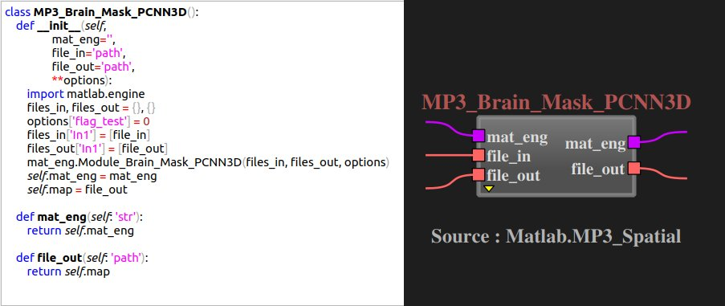
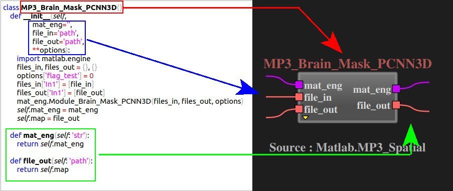

How to create a block
=====================

This page explains how to create a new block in the library.

Explanation
-----------

All blocks in the library are written in Python and are located in the 'root_of_skrypy_venv/skrypy/NodeEditor/modules' folder. |br|
A block corresponds to a Python class (in its conventional form). |br|

.. # define a hard line break for HTML
.. |br| raw:: html

    
